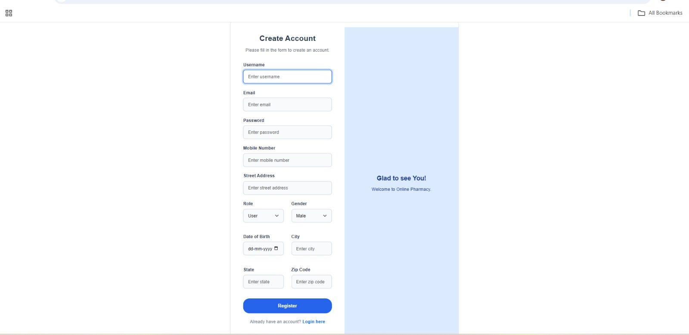
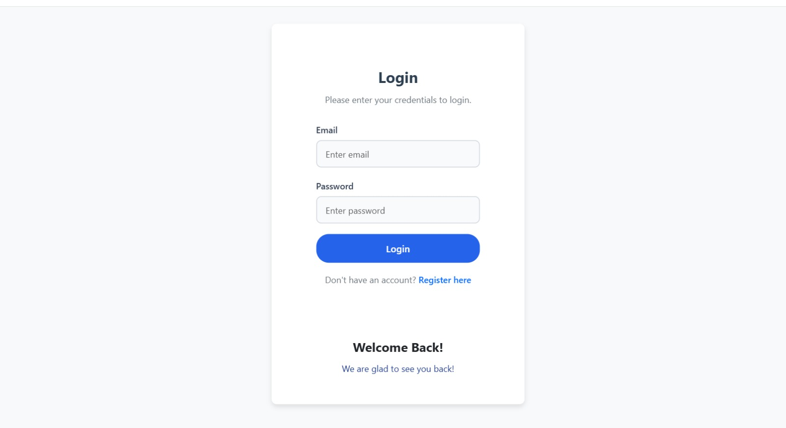
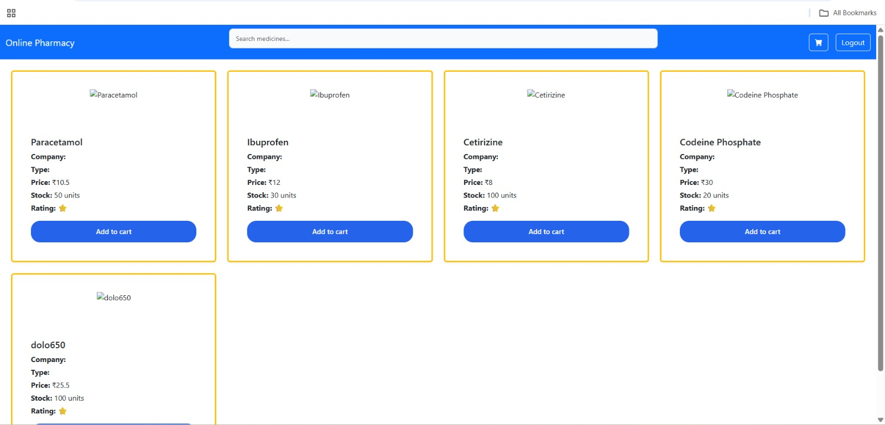
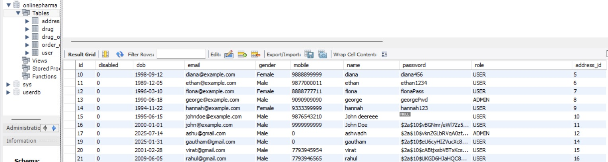
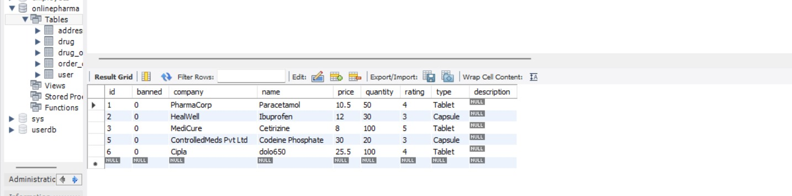

# 💊 Online Pharmacy Portal

This project is aimed at building an **Online Pharmacy System**, where users can register, browse drugs, manage orders, and perform operations through a secure and interactive web portal.

---

## 🚀 TECHNOLOGIES USED

### Frontend 📫
<p>
  
  
  
</p>

### Server Side ⚡
<p>
  
  
</p>

### Development 🔭
<p>
  
</p>

### Development Tools 📺
<p>
  
  
</p>

### Database 📦
<p>
  
</p>

---

## 🛠️ Installation & Setup Guide

### ✅ Prerequisites

Make sure the following are installed:

- Java JDK 17+
- Node.js (v14+)
- npm or yarn
- MySQL Server
- Maven
- IDE (VS Code or Eclipse)
- React.js (already cloned project)
---

## 🔧 Backend Setup (Spring Boot + MySQL)

### 📂 1. Clone the Repository

```bash
git clone https://github.com/your-username/online-pharmacy-portal.git
cd onlinepharma_backend
````

---

## 🗄️ Database Setup

### 1. Install MySQL and create a new database

```sql
CREATE DATABASE online_pharmacy;
```

### 2. Configure database connection in `application.properties`

```properties
spring.datasource.url=jdbc:mysql://localhost:3306/online_pharmacy
spring.datasource.username=your_username
spring.datasource.password=your_password
```

---

### 🚀 3. Build and Run the Spring Boot App

```bash
mvn clean install
mvn spring-boot:run
```

> Backend will run at: `http://localhost:8080`

---

## 🌐 Frontend Setup (React.js)

### 1. Navigate to Frontend Directory

```bash
cd ../onlinepharma_frontend
```

### 2. Install Dependencies

```bash
npm install
```

### 3. Start React App

```bash
npm start
```

> Frontend will run at: `http://localhost:5173`

---

## 📬 Postman Collection (API Testing)

You can test backend APIs using Postman.

### 📥 Download

* 🔗 [Postman Collection (.json)](backend/onlinepharma_backend/src/main/resources/postman/OnlinePharmacy.postman_collection.json)
* 🔗 [Environment File (.json)](backend/onlinepharma_backend/src/main/resources/postman/OnlinePharmacyEnvironment.postman_environment.json)

### 🛠 Usage

    1. Open [Postman](https://www.postman.com/downloads/)
    2. Import the collection and environment files
    3. Select the environment in Postman
    4. Test endpoints (e.g., `/api/auth/login`, `/api/drugs`, `/api/order`)

> Use Bearer Token auth after login for protected routes.

---


## 🧪 Test the Application

    1. Open `http://localhost:5173`
    2. Register/Login
    3. Explore:  Drug browsing & ordering, Cart handling, Admin functions

---

## 📌 Features

### 🔐 Authentication & Authorization

* User login/logout
* Admin approval before orders

### 💊 Drug Management (Admin)

* Add, update, delete drugs
* Search by ID or name

### 👥 Member Management

* Admin:

  * View, update, disable, delete members
* Members:

  * Edit profile (email, phone, etc.)

### 🛒 Medicine Order

* Add multiple drugs to cart
* Auto-calculate total
* Prevent order of out-of-stock items
* Update stock on order
* Auto-clear cart on completion

---

## 🧩 Modules

* **Login & Registration**
* **Drug Management**
* **User/Member Management**
* **Order & Cart Handling**

---

## 🖼️ UI View

### Register Page



### Login Page



### User Dashboard



### User Table (Database)



### Drugs Table (Database)



---

